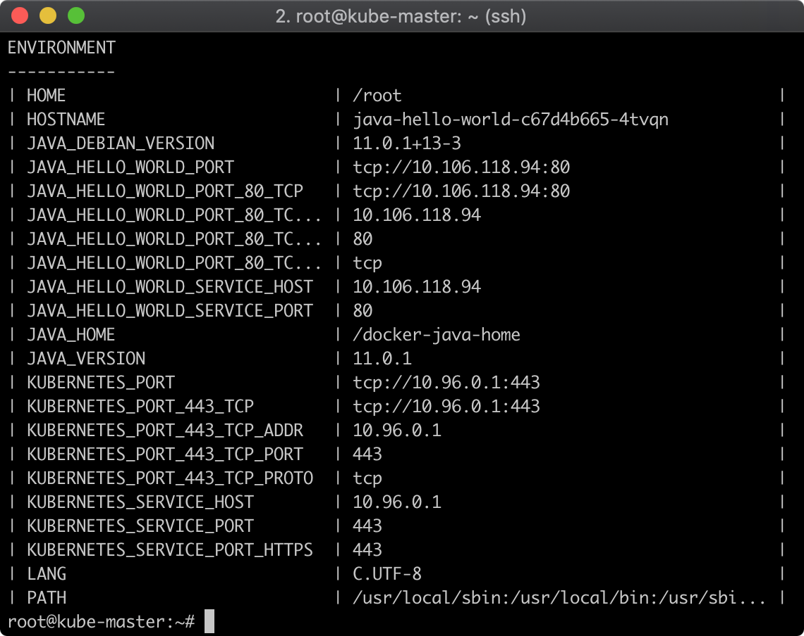

Java Demo Application
=====================

Java Demo Application for [Kubernetes](https://kubernetes.io/).

Overview
--------

The demo runs on HTTP port 8080, and provides the current system environment variables formatted as an ASCII table:



This is useful for exploring the environment of a Kubernetes [pod](https://kubernetes.io/docs/concepts/workloads/pods/pod/). For example, the `HOSTNAME` variable tells which pod is serving the request.

Build
-----

This demo requires Java 11.

**Option 1:** Build the Docker image manually:

```sh
mvn package
docker build -t fstab/java-demo .
```

**Option 2:** Build using the [Docker maven plugin](https://dmp.fabric8.io/):

```sh
mvn package docker:build
```

A pre-built Docker image is available on [fstab/java-demo](https://hub.docker.com/r/fstab/java-demo/).

Run
---

Test locally:

```sh
docker run -p8080:8080 --rm fstab/java-demo
```

Deploy on Kubernetes

```yaml
kubectl create -f java-demo.yaml
```

The deployment in `java-demo.yaml` references the Docker image [fstab/java-demo](https://hub.docker.com/r/fstab/java-demo/). If you create your own image, update the image location in `java-demo.yaml` accordingly.

Test
----

Test locally:

View [http://localhost:8080](http://localhost:8080).

Test on Kubernetes:

1.  Get the service's [Cluster IP](https://kubernetes.io/docs/concepts/services-networking/service/):
    ```bash
    export DEMO_SERVICE_IP=$(kubectl get service java-demo -o=jsonpath='{.spec.clusterIP}')
    ```
2.  Access the pods through the service's Cluster IP:
    ```bash
    curl $DEMO_SERVICE_IP
    ```

Notes
-----

You see a compile error in Intellij Idea? Me too, filed this bug report [https://youtrack.jetbrains.com/issue/IDEA-203791](https://youtrack.jetbrains.com/issue/IDEA-203791).
